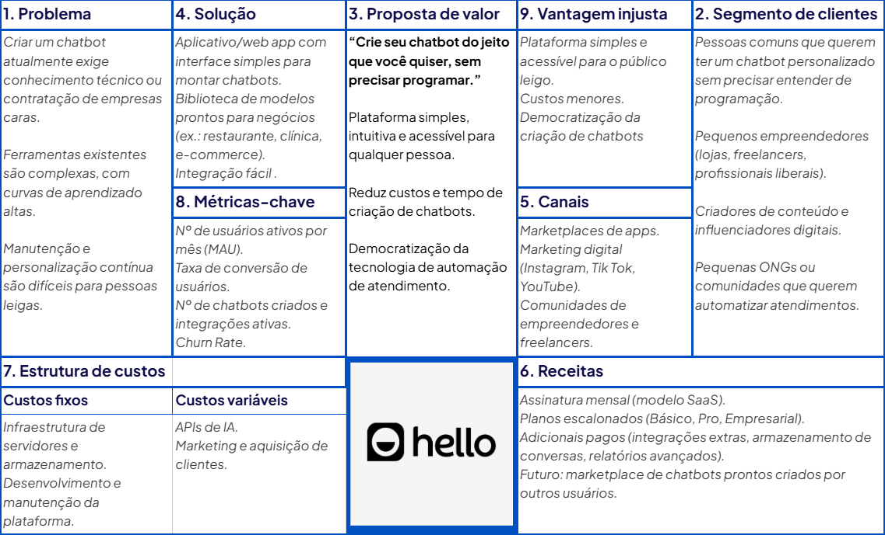

# 📌 Hello Hub

Atualmente, criar chatbots é uma tarefa complexa, cara e que exige conhecimentos técnicos, limitando o acesso de pequenos negócios, criadores de conteúdo e comunidades à automação de atendimento. HelloHub resolve esse problema oferecendo uma plataforma no-code intuitiva, que permite criar chatbots personalizados de forma rápida, utilizando modelos prontos para diferentes tipos de negócio e integrando facilmente com sites e redes sociais. O usuário pode montar seu chatbot apenas arrastando elementos e configurando respostas, sem precisar programar.

---

## 👥 Integrantes

- Marcos Henrique Gollin Filho – RA: 765313  
- Diogo Nascimento Ruis – RA: 810401  
- Nathan Furchi Alvisi – RA: 806750
- César Henrique Policarpo de Melo – RA: 815695  

---

## 🧭 Etapas do Projeto

### 1️⃣ Definição do Problema e da Solução
- **Problema identificado:**  Criar um chatbot atualmente exige conhecimento técnico, ferramentas existentes são complexas, manutenção e personalização contínua são difíceis para pessoas leigas.
- **Público-alvo:**  Pessoas comuns que querem ter um chatbot personalizado, pequenos empreendedores, criadores de conteúdo e influenciadores digitais, pequenas ONGs ou comunidades que querem automatizar atendimentos.
- **Impacto esperado:**  O impacto esperado do HelloHub é democratizar a criação de chatbots, tornando acessível para qualquer pessoa uma tecnologia antes cara e complexa.
- **Solução proposta:**  Aplicativo/web app com interface simples para montar chatbots, biblioteca de modelos prontos para negócios (ex.: restaurante, clínica, e-commerce) com integração fácil.

### 2️⃣ Lean Canvas / Missão, Visão e Valores
- **Lean Canvas**: 
- **Missão**: Tornar a criação de chatbots simples, acessível e intuitiva, permitindo que qualquer pessoa ou negócio utilize automação de forma prática e sem barreiras técnicas.  
- **Visão**: Ser, até 2030, a principal plataforma global de criação de chatbots no-code, reconhecida pela simplicidade, inovação e impacto na democratização da tecnologia de automação.  
- **Valores**:
  - **Acessibilidade**: tecnologia ao alcance de todos.  
  - **Inovação**: melhoria contínua para facilitar a vida dos usuários.  
  - **Simplicidade**: foco em interfaces intuitivas e fáceis de usar.  
  - **Confiabilidade**: oferecer segurança, transparência e suporte.  
  - **Colaboração**: construir comunidade e valor junto a clientes e parceiros.  

### 3️⃣ Custos e Tributos (Plano de Negócios - PNBOX)
- Custos fixos:  Totalizam R$ 7.500,00 por mês. Incluem o pró-labore de toda a equipe (4 pessoas x R$ 1.500 = R$ 6.000,00) e os serviços de contabilidade (R$ 500,00).
- Custos variáveis:  Totalizam R$ 9.500,00 por mês (estimativa inicial). Incluem os gastos com infraestrutura de nuvem (R$ 3.000,00), APIs de terceiros (R$ 1.500,00), marketing e anúncios (R$ 5.000,00) e taxas sobre vendas (estimadas em R$ 1.000,00, mas que variam com o faturamento).
- Tributos aplicáveis:  Como prestadora de serviços de software (SaaS), a empresa se enquadra no Simples Nacional.

### 4️⃣ [Investimentos e Precificação](**https://github.com/ICEI-PUC-Minas-PPC-CC/icei-puc-minas-ppc-cc-tai3-022025-HelloHub/blob/main/docs/plano_de_negocio.md**)
- Investimento inicial: R$ 64.000,00 (Incluindo investimentos fixos, pré-operacionais e giro iniciaL).
- Estratégia de precificação: Nossa estratégia de precificação combina modelo freemium e planos pagos acessíveis (R$59 a R$149/mês), garantindo simplicidade, competitividade e alto valor entregue ao cliente.
- Justificativa:  A precificação foi definida com base no valor entregue (simplicidade e economia), na capacidade de pagamento do público-alvo e na análise da concorrência, garantindo acessibilidade sem perder competitividade.

### 5️⃣ SWOT (Análise de Ambientes)
- Forças:  
- Fraquezas:  
- Oportunidades:  
- Ameaças:  

### 6️⃣ Planejamento Estratégico (BSC)
- Objetivos estratégicos:  
- Indicadores e metas:  
- Ações planejadas:  

### 7️⃣ Fluxo de Caixa
- Planilha ou print do fluxo projetado:  
- Principais considerações:  

### 8️⃣ Valuation
- Método utilizado:  
- Valor estimado:  

### 9️⃣ Segurança Cibernética
- Riscos identificados:  
- Medidas de segurança:  

---

## 📅 Diário de Bordo

| Data       | Conteúdo/Etapa                     | Status     | Observações |
|------------|------------------------------------|------------|-------------|
| 06/08/2025 | Apresentação Disciplina + Start    | ✅ Concluído | — |
| 13/08/2025 | Definição dos Grupos e Propostas   | 🚧 Em andamento | Ajustar proposta com feedback do professor |

---

## 📦 Entregas

| Entrega                                | Data       | Descrição                                                         | Status |
|----------------------------------------|------------|-------------------------------------------------------------------|--------|
| Lean Canvas                            | 20/08/2025 | Documento e imagem do canvas                                      | —      |
| Custos e Tributos                      | 27/08/2025 | Planilha com custos fixos, variáveis e tributos                   | —      |
| Análise SWOT / Plano de Negócios       | 24/09/2025 | Análise de ambientes SWOT e entrega do Plano de Negócios          | —      |
| Fluxo de Caixa / Planejamento Estratégico | 15/10/2025 | Planilha de fluxo de caixa e entrega do Planejamento Estratégico  | —      |
| Valuation                              | 05/11/2025 | Relatório com cálculo de valuation                                | —      |
| Valuation      | 12/11/2025 | Valuation | —      |

---

## 🗣️ Feedbacks Recebidos

| Data       | De Quem     | Feedback                                                        | Ação Tomada |
|------------|-------------|----------------------------------------------------------------|-------------|
| 24/09/2025 | Professor X | Melhorar clareza da análise SWOT                                | Revisão feita |

---

## 📚 Lições Aprendidas
- O que a equipe aprendeu durante cada fase.  

---

## 📁 Organização do Repositório

```
📦 projeto/
 ┣ 📂 docs/
 ┃ ┣ lean_canvas.png
 ┃ ┣ custos_tributos.xlsx
 ┃ ┣ swot_plano_negocios.pdf
 ┃ ┣ fluxo_caixa_planejamento.xlsx
 ┃ ┗ valuation.pdf
 ┣ 📂 src/
 ┃ ┣ prototipo/
 ┃ ┗ documentos_planejamento/
 ┣ README.md
```

---
